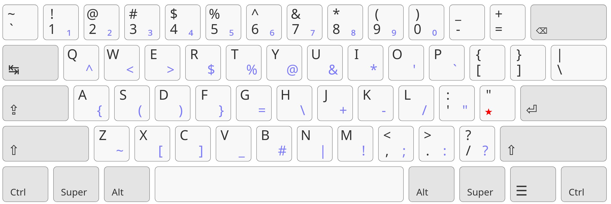

Lafint
======
Template de clavier qwerty international basé sur le clavier qwerty-lafayette.

basé sur <https://qwerty-lafayette.org/>

Disclaimer
----------
Ce projet contient uniquement la customization au format toml du clavier. 
Toute la documentation est donc portée par les créateurs du projet qwerty-lafayette donc je ne fait pas parti.

QuickStart
===========

Installation
------------

Utilisation
-----------

Tous les clavier qwerty internationaux lafayete et lafint se basent sur un touche morte que l'on presse pour faire un accent avant de presser la voyelle.
Cette touche morte est sur le ; sur le lafayette, et sur le "'" en lafint et en international

Voila les différences essentielles du lafint par rapport à un qwerty international: 
 - la touche d'accent ' est plus orientée français et va doc produire les accents utilisés en français ,"éèê" etc., et aussi la cédille, le oe lié.
 - la touche ; est réutilisée pour produire une single quote ' en accès direct. ce caractère est beaucoup trop utilisé en français pour être en accès indirect
 - le caractère ; est produit par la combinaison '; . on a réutilisé cette touche, mais ces 2 touches sont cote à cote, c'est assez facile de mémoriser le pattern.

Voila les différences essentielles du lafint par rapport à un qwerty lafayette:
 - remettre la touche morte sur la meme touche qu'en qwerty international pour faciliter la mémorisation des touches
 - remettre les caractères <> en accès shift ( il faut utiliser altgr avec le lafayette)
 - globalement on peut se servir de ce clavier sans utiliser le altgr
 - le ; qu'on a perdu en accès direct pour cause de réutilisation de touche se fait maintenant en accès indirect
 - les disposition de l'accents é, se fait comme en qwerty international plutot qu'en lafayette ( pas très clair mais à l'utilisation vous comprendrez)
 - Sur le shift touche morte, la touche redevient un accès direct pour conserver la touche " d'origine du qwerty international.
 

Explications
============

Pourquoi le qwerty?
-------------------
En 2 mots: tous les langages de programmation, y compris , a ligne de commande, sont tournés vers le qweryy, les symboles utilisés sont tous regroupés, logique et disponible en accès direct.
je citerais par exemple les caractères {}[]|\'"<> tous sur la meme colonne de droite.

Et pour les français ce clavier ne pose paas de problème, je peux utiliser tous les accents de l'azerty + les accents majuscules non possibles en azerty
Les dispositions utilisables pour le français sont pour moi:
 - le qwerty international, disponible de partout
 - le qwerty lafayette, facile á installer depuis le site dédié
 - le qwerty lafint (Lafayette International) intermédiaire entre les 2
 
Pourquoi mon propre format
--------------------------
Honnêtement le lafayette est surement mieux fait, si vous tombez ici par hasard, essayez plutot le lafayette, mais voici pourquoi moi j'ai fait une autre disposition:
 - Pour utiliser Kalamine, l´outil qui sert a génerer aussi lafayette. c'est un outil de customisation amusant
 - Pour switcher plus facilement entre qwerty us,international, personnalisé
 - parce que le qwerty international est un peu plus lourd a utiliser
 - parce que le qwerty lafayette nécessite de réapprendre un peu plus le clavier, 
    notamment je regarde mon clavier quand le tape, meme si c'est mal, et en qwerty international ou lafint, les touches correspondent bien a un qwerty us. 
 

